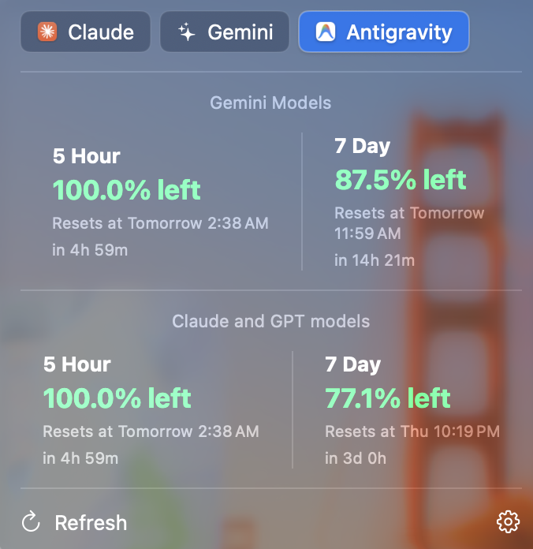
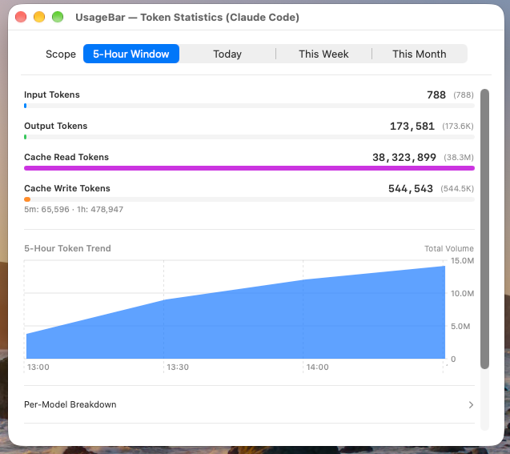

# UsageBar

A macOS menu bar app that shows your Claude, Gemini, and Antigravity usage limits at a glance — how much of your 5-hour and weekly quota you have left, with color-coded warnings and a notification when you're about to run out.



The menu bar badge itself switches icon, label, and color depending on which account you're looking at:

 

## Why

Claude, Gemini, and Antigravity's web apps all show your usage limits somewhere in their settings, but you have to go dig for it. This puts the number in your menu bar, refreshed automatically.

## Features

- Menu bar badge shows the tightest constraint (5-hour or weekly, whichever is closer to running out) with green/yellow/red coloring.
- Switch between multiple accounts via tabs in the dropdown panel — each account keeps polling in the background, not just the one you're currently looking at.
- Native macOS notification the moment any window crosses into the red zone.
- Configuration panel to choose which accounts show up in the main panel, trigger a manual re-login per account, and view a small in-app activity log for troubleshooting.
- Launch at login, optional.
- **Token usage statistics (Claude Code only)**: a separate window showing exact token counts (not just quota percentage) for the current 5-hour window, today, this week, and this month, broken down by input/output/cache tokens and by model. Includes a historical trend chart and an estimated dollar cost based on Anthropic's published per-model pricing (fetched periodically, with a manual refresh option).



## How it works (and why it might break)

None of Claude, Gemini, or Antigravity publish an official, documented API for personal usage data. This app works by reusing your own logged-in browser session (the same cookies your browser already has) to call the same internal endpoints their own web apps use — the same general approach as many browser extensions that show usage stats.

Because these are undocumented, unofficial endpoints, **this app can break at any time** if Claude, Gemini, or Antigravity change how their web app talks to their own backend. It is not affiliated with, endorsed by, or supported by Anthropic or Google. Use at your own risk, and expect the occasional breakage after any of these companies ships a frontend change.

No credentials are stored in plain text: session cookies live in the app's own isolated WebKit storage (the same mechanism Safari/Chrome use), and any long-lived tokens go through the macOS Keychain.

## Install

1. Download the latest `.zip` from the [Releases page](https://github.com/chrisadvs/UsageBar/releases/latest).
2. Unzip it and drag `UsageBar.app` into `/Applications`.
3. **Right-click the app and choose Open** (don't just double-click) the first time. The app isn't signed with a paid Apple Developer certificate, so macOS Gatekeeper will otherwise refuse to open it with an "unidentified developer" warning. This is only needed once.

## Building from source

For development, or if you'd rather build it yourself than run a downloaded binary.

Requires Xcode and [XcodeGen](https://github.com/yonaskolb/XcodeGen) (`brew install xcodegen`).

```bash
git clone https://github.com/chrisadvs/UsageBar.git
cd UsageBar
xcodegen generate
open TokenUsageWidget.xcodeproj
```

Then build and run from Xcode (`Cmd+R`), or archive it (`Product > Archive`) to produce your own standalone `.app`.

## Supported providers

| Provider | Status |
|---|---|
| Claude | Working |
| Gemini (web) | Working |
| Antigravity (web) | Working |

## Acknowledgments

- [ccusage](https://github.com/ryoppippi/ccusage) (MIT) — the tiered-by-cache-type pricing calculation (separate multipliers for 5m cache write, 1h cache write, and cache read) follows the approach used in this project.
- [ccusage-menubar](https://github.com/Saqoosha/ccusage-menubar) — the two-tier cache + deduplication direction, and the general feasibility of a native Swift rewrite, were informed by this project's public README. No source code from it was read or reused (it has no LICENSE file, so none was taken).

## License

MIT — see [LICENSE](LICENSE).
